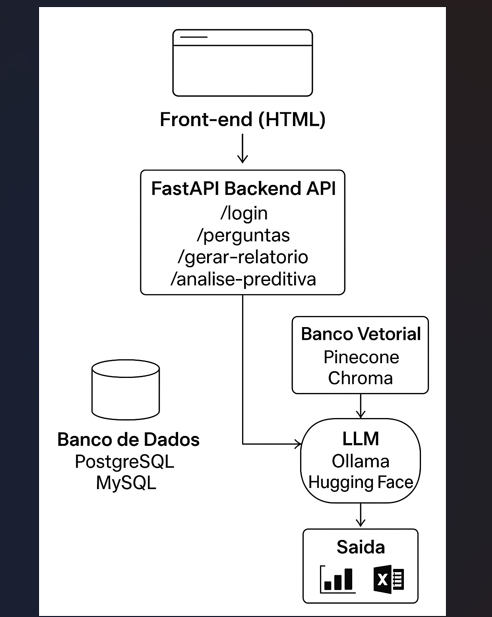

# Desafio Técnico para o Departamento Pessoal

## Índice:

- [Índice](#indice)
- [Objetivo](#objetivo)
- [Sobre](#sobre)
- [Arquitetura](#arquitetura)
- [Bibliotecas](#bibliotecas)
- [Instalações](#instalações)
- [Testes](#testes)
- [Licença](#licença)
- [Próximos Passos](#próximos-passos)
- [Contato](#contato)

## Objetivo:

O Objetivo do desafio é criar uma solução que utilizar Inteligência artificial, para auxiliar em questão de gerenciar o departamento pessoal, destinada a atender demandas dos servidores públicos.

## Sobre:

Na solução do desafio propostos foi realizado uma definição é a delimitação de quais problemas podem atender nesse primeiro momento com auxílio da Inteligência Artificial, em seguida foi realizado a criação do banco e dos endpoints da API para a realização das consultas e em relação a solicitações de dúvidas sobre afastamento e licenças. E por último será realizado a criação do endpoint, para fazer análise preditiva, na qual irá retornar gráficos com os resultados.

## Arquitetura:



## Estrutura do Projeto
``````

DESAFIO_TECNICO_DP/
│
├─ src/
│  ├─ app/
│  ├─ docs/
│  └─ tests/
│
├─ venv/
│
├─ .env
├─ .gitignore
├─ docker-compose.yml
├─ Dockerfile
├─ image.png
├─ Kanban.md
├─ LICENSE
├─ README.md
└─ requirements.txt
``````

## Bibliotecas:

- python
- mysql
- postgresql
- sqlalchemy
- docker
- pytest
- uvicorn  
- langchain
- ollama


## Instalações

``````

Instalções:

git clone https://github.com/vanessaformiga/desafio_tecnico_dp

python -m venv venv

venv/Scripts/activate (windows)

source venv/bin/activate (linux)

pip install -r requirements.txt

pip freeze > requirements.txt

``````

#### Python Local
``````

Para a execução dos scrip na máquina 

Acesse as pastas 

cd src

cd app

Para criar as tabelas do histórico 

execute o comando antes python create_historico.py

e depois 

e execute o comando

uvicorn main:app --reload

``````

#### Docker

``````

Rodando com Docker

Subir containers (API + MySQL + Postgres):

docker-compose up --build

Adicione -d para rodar em background:

docker-compose up --build -d

Parar containers:

docker-compose down

Visualizar logs:

docker-compose logs -f

Acessar a API:

http://localhost:8000

``````

## Testes:

Para testar execute o comando 

``````

pytest src/tests/test_users.py --disable-warnings -v

``````

## Licença:

MIT License

## Próximos Passos:

Nessa seção será incluído quais serão os próximos passos que podem ser incluídos a seguir na aplicação.

- Criação do Endpoint para a solicitação das férias

## Contato:

Neste projeto foi criado por Vanessa Formiga

Em caso de dúvida entre em contato vanessaformiga21@gmail.com